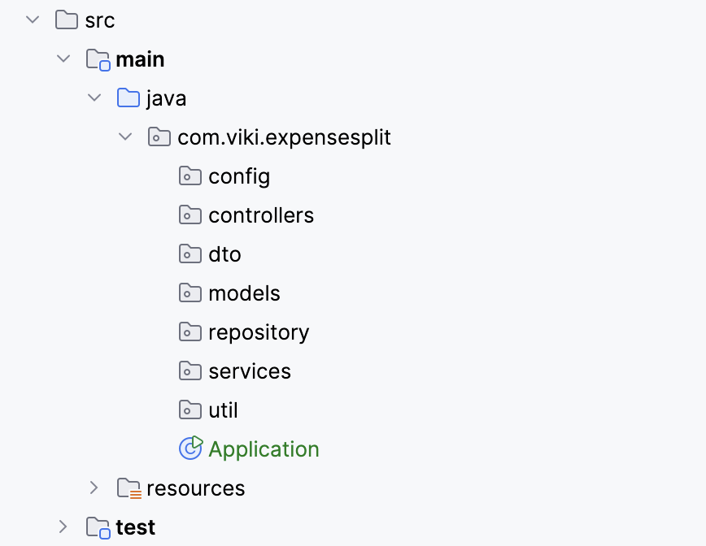

# Expense Split

## App Struture
The app is strucutred according to the best pracices mention [here](https://malshani-wijekoon.medium.com/spring-boot-folder-structure-best-practices-18ef78a81819)

- Config: Contains configuration classes
- Controller: Contains your RESTful controller classes.
- DTO (Data Transfer Object): DTOs used to transfer data between different layers of an application, like the service layer and the presentation layer.
- Enum (Enumeration class): Enum classes are typically used to represent a set of closely related and pre-defined values.
- Model: The model folder stores data models or entities that represent structure and behaviour of the application domain. These classes are mapped to database tables and define the properties and relationships of the application data.
- Repository: Contains repository classes that deal with data access. 
- Service: Contains service classes that implement business logic. 
- Util (Utilities): a general practice followed in many programming languages and frameworks to place utility classes to keep the codebase organized and modular.
- Enums: enums for the project