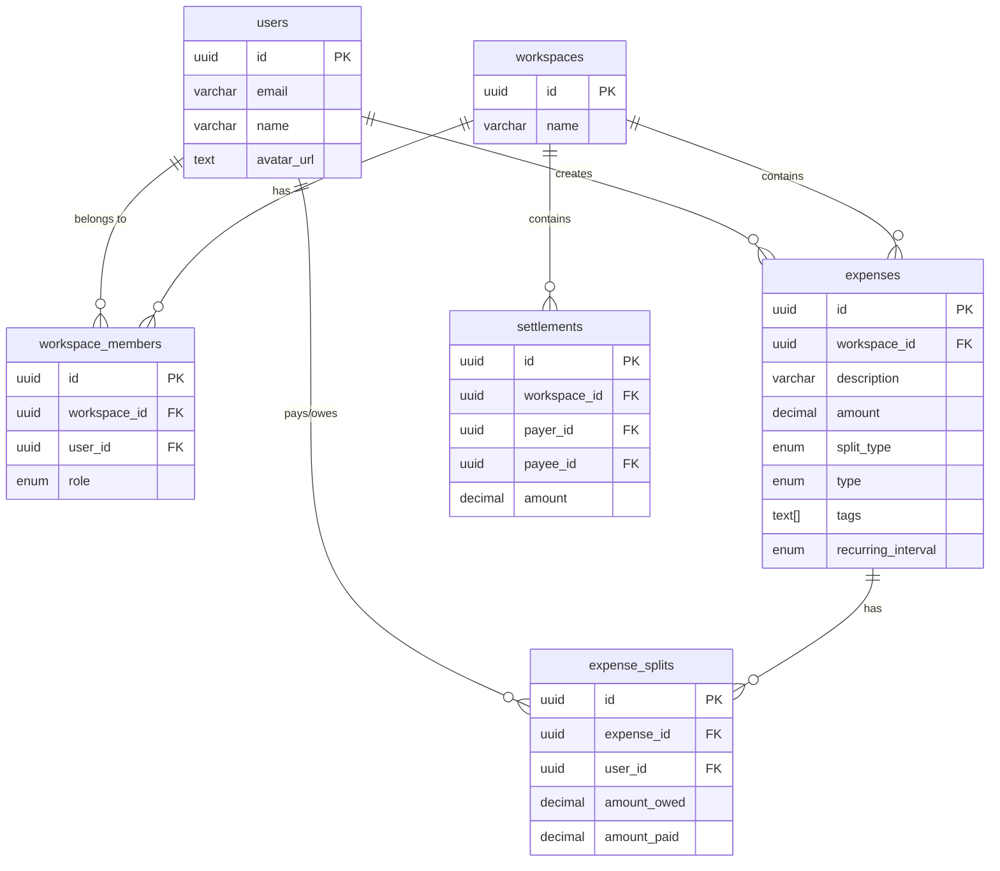

# Persistence Architecture

This document outlines the database schema and data relationships for ExpenseSplit. The database is a PostgreSQL instance (hosted on Neon) and is managed via **Drizzle ORM**.

## Entity Relationship Diagram

## Table Structures

### 1. Core Entites
- **`users`**: Represents individuals logged in via Google OAuth. 
- **`workspaces`**: The highest-level container. Workspaces act as isolated tenants. All debts and expenses are scoped to a single workspace.

### 2. Groupings & Membership
- **`workspace_members`**: Junction table mapping users to workspaces, storing authorization roles (`ADMIN`, `MEMBER`). Row-Level Security (RLS) is applied based on this table.
- *(Note: A Workspace is conceptually equivalent to a "Group" in typical expense splitting apps like Splitwise. The previously redundant `groups` tables have been removed to flatten the hierarchy and simplify UX.)*

### 3. Financial Ledgers
- **`expenses`**: The core transaction record. Note that an expense does **not** have a `paid_by` column. Instead, it relies entirely on the splits table to support multi-payer logic. It also supports cash transfers via the `type` column (`EXPENSE` vs `TRANSFER`).
- **`expense_splits`**: Links an expense to a user. Crucially, it stores both:
  - `amount_paid`: How much the user put out of pocket for the expense.
  - `amount_owed`: How much of the total cost is mathematically assigned to this user.
  - *Note*: Net balance for a single expense = `amount_paid - amount_owed`.
- **`settlements`**: Direct cash transfers resolving debts between two users (`payer_id` and `payee_id`).

## Multi-Payer Split Architecture
When an expense of $100 is paid by Alice ($60) and Bob ($40), and split evenly among Alice, Bob, and Charlie:
1. `expenses` is inserted ($100).
2. `expense_splits` for Alice: `amount_paid: 60`, `amount_owed: 33.34`. (Alice is +26.66)
3. `expense_splits` for Bob: `amount_paid: 40`, `amount_owed: 33.33`. (Bob is +6.67)
4. `expense_splits` for Charlie: `amount_paid: 0`, `amount_owed: 33.33`. (Charlie is -33.33)
